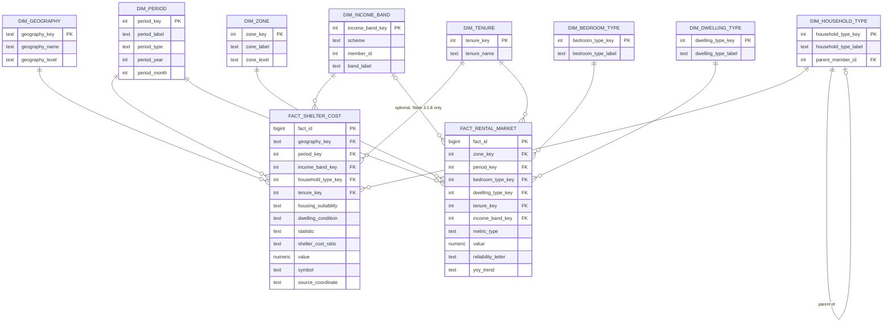

# Conceptual ER Model — Windsor Housing Warehouse

**Scope:** the two sources actually profiled so far — StatCan 98-10-0252-01 (shelter-cost-to-income ratio) and CMHC Windsor RMS 2025. The proposal names two more sources (Census Profile 98-401, CMHC starts/completions) that nobody has downloaded or profiled yet — their fact tables aren't modeled here, since that would mean guessing a schema for files this team hasn't opened. Add them once they're profiled, following the same pattern.

**Status:** implemented and verified against real Postgres (`sql/warehouse_schema.sql`, `sql/warehouse_seed_dimensions.sql`, run via `etl/create_warehouse_schema.py`) — not just a diagram. **Not yet reviewed with Pavan** — that review hasn't happened; this is ready for that conversation, not a substitute for it.

## Why not all 8 dimensions apply to both fact tables

This is a real property of these two surveys, not a gap:

| Dimension | Used by | Why |
|---|---|---|
| `dim_geography` | shelter_cost only | StatCan's CMA-level, DGUID-based geography |
| `dim_zone` | rental_market only | CMHC's sub-CMA zones — a finer, source-specific grain, not the same thing as `geography` renamed |
| `dim_period` | both | Different grains (StatCan census year vs. CMHC survey month), unified via `period_type` |
| `dim_tenure` | both | CMHC RMS is rental-only, so every `fact_rental_market` row is implicitly `tenure = 'Renter'` — still modeled as a real FK for conformance, not hardcoded |
| `dim_income_band` | both (optional on rental_market) | StatCan's dollar-bracket scheme and CMHC's income-quintile scheme (Table 3.1.8) are different classifications — one table, a `scheme` column distinguishes them rather than forcing false equivalence |
| `dim_household_type` | shelter_cost only | CMHC RMS has no household-composition dimension |
| `dim_bedroom_type`, `dim_dwelling_type` | rental_market only | StatCan shelter-cost has neither |

**One naming trap avoided:** StatCan's "Dwelling condition" (needs repair, yes/no) is *not* the same concept as `dim_dwelling_type` (Apartment / Row / Combined, from CMHC) despite the similar name. Dwelling condition stays a local text attribute on `fact_shelter_cost`; it was never a candidate for the shared dimension.

## ER Diagram

## Fact table grains

- **`fact_shelter_cost`** — one row per (geography × period × income_band × household_type × housing_suitability × dwelling_condition × statistic × shelter_cost_ratio × tenure) combination. `housing_suitability`, `dwelling_condition`, `statistic`, `shelter_cost_ratio` are degenerate dimensions (local text columns) — none are among this task's 8 listed shared dimensions, so they aren't broken out into their own tables.
- **`fact_rental_market`** — one row per (zone × period × bedroom_type × dwelling_type × tenure × metric_type) combination, with `income_band_key` nullable (populated only for Table 3.1.8-sourced rows — vacancy by income quintile). `metric_type` unifies CMHC's several metric tables (vacancy rate, average rent, universe, turnover, etc.) into one fact table, per the task's "one fact table per source" instruction, rather than one fact table per CMHC metric sheet.

## What's seeded vs. what's still pending

**Seeded** (real category values from `docs/shelter_cost_audit.md` and `docs/cmhc_rms_sheet_catalogue.md`, not invented):
- `dim_geography`: Windsor CMA (the only geography this project has actually extracted so far)
- `dim_period`: 2021 census year, Oct-24 and Oct-25 CMHC survey periods
- `dim_tenure`: Total, Owner, Renter
- `dim_income_band`: 14 StatCan brackets + 5 CMHC quintiles (19 rows)
- `dim_household_type`: all 16 real StatCan categories, with `parent_member_id` preserving the hierarchy — this is also where the household-type label collision documented in the audit note lives (member 5 and 10 both render as "Without children" under different parent branches; the surrogate key disambiguates them even though the label alone doesn't). Verified by querying both collision pairs back out with their parent labels.
- `dim_bedroom_type`: Studio, 1BR, 2BR, 3BR+, Total
- `dim_zone`: all 7 real zones + 2 published aggregates
- `dim_dwelling_type`: Apartment, Row (Townhouse), Combined

**Verified working, not just created:** inserted one real, already-confirmed value into each fact table inside a transaction (Owner households spending 30%+ = 13,005, matching every prior calculation of this number this session; Windsor CMA combined vacancy rate = 5.9%, from Table 3.1.1) — both resolved through every FK correctly — then rolled back, since actually populating the fact tables is a separate ETL task, not part of this one.

**Pending:**
- Review with Pavan — not done yet.
- Actual fact-table population (this task only proves the schema works, via the rolled-back smoke test above).
- Census Profile and CMHC starts/completions sources, once profiled.

## Files

- `sql/warehouse_schema.sql` — dimension + fact table DDL
- `sql/warehouse_seed_dimensions.sql` — real dimension member data
- `etl/create_warehouse_schema.py` — creates and seeds the schema (safe to re-run — drops `warehouse` schema first)
